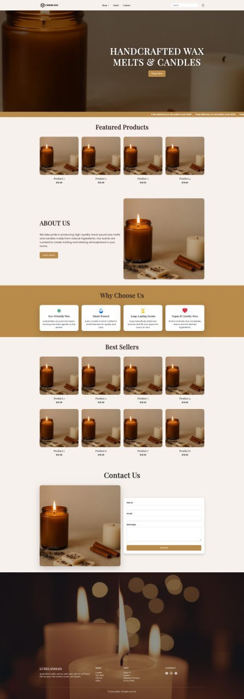

# 🕯️ Candle & Wax Melts Store – Django E-commerce Project

An elegant, pastel-themed e-commerce website built with Django, showcasing products such as candles and wax melts. This project simulates a small business storefront, with a clean responsive design and customizable product catalog.

## 🔧 Tech Stack

- Python & Django
- HTML5, CSS3, Bootstrap 5
- PostgreSQL (or SQLite for dev)
- Django Admin for product management

## 📦 Features

- Product listing and individual product pages
- Modular app structure (products, store logic, etc.)
- Clean and modern responsive UI
- Image support for product thumbnails
- Admin panel for easy product management

## 🚀 Getting Started

Clone the project:
```bash
git clone https://github.com/Daniel0Marsh/candle-store-django.git
cd candle-store-django
```
Create virtual environment & install dependencies:
```bash
python -m venv venv
source venv/bin/activate  # or venv\Scripts\activate on Windows
pip install -r requirements.txt
```
Run migrations & start the server:
```bash
python manage.py migrate
python manage.py runserver
```
Visit http://127.0.0.1:8000/ to view the site locally.

## 📸 Screenshots

| Homepage                        | Logo                    |
|---------------------------------|-------------------------|
|  |  |

---

Made by [Daniel Marsh](https://github.com/Daniel0Marsh) • [codeblock.io](https://codeblock.io)
